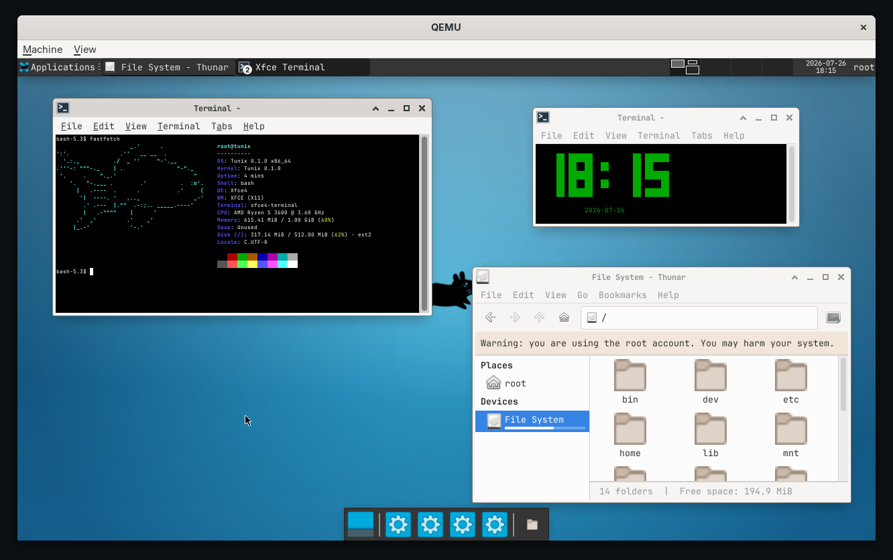

# Tunix

Tunix is a small Unix-like operating system experiment for x86_64. It includes a custom bootloader, kernel, initramfs-based userspace, framebuffer terminal, and a small set of ported userland tools.



## Features

- Custom bootloader and kernel code
- Persistent ext2 root filesystem on the boot disk (Linux-mountable); the
  initramfs only seeds it on first boot
- tmpfs-like volatile `/tmp`, `/run`, `/dev`, `/proc`
- Framebuffer terminal with keyboard input
- Basic VFS, devfs, procfs, process, and syscall support
- GNU userland (coreutils, grep, sed, gawk, findutils, diffutils, tar, gzip, make), Bash, TinyCC, binutils, nano, Lua, and selected libraries
- Git, with an `https://` transport via a static libcurl built against mbedTLS
  (so `git clone https://…` works); `ssh://` remotes are not supported
- dinit as PID 1: services under `/etc/dinit.d`, controlled with `dinitctl`
- A full Xfce desktop on Xorg (xfwm4, xfce4-panel, xfdesktop, Thunar and
  xfce4-terminal), started automatically at boot; a Weston (Wayland) session is
  also available

## Quick Start

Initialize submodules first:

```sh
git submodule update --init --recursive
```

Build the disk image:

```sh
make all
```

Run it in QEMU:

```sh
make run
```

Or run headless:

```sh
make headless
```

Clean generated files:

```sh
make clean
```

## Documentation

- [Build and Run](docs/build-and-run.md)
- [Ports](docs/ports.md)
- [Syscalls and Scheduler](docs/syscalls-and-scheduler.md)
- [Persistent Filesystem](docs/persistent-filesystem.md)
